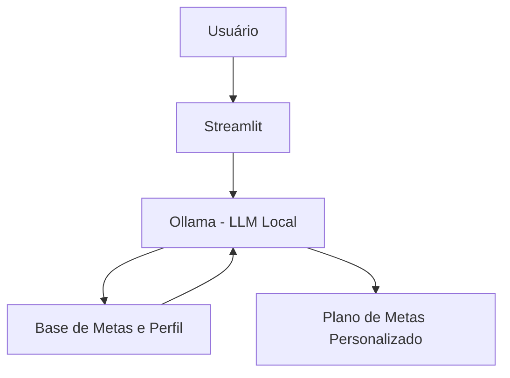

# 📉 Ben - Seu Melhor Planejador Financeiro de Metas

> Assistente virtual especializado em criar planos de ação personalizados para metas financeiras de curto, médio e longo prazo.

## 💡 O Que é o Ben?

O Ben é um assistente estratégico que foca no planejamento e não apenas no cálculo. Ele ajuda o usuário a definir metas claras (como comprar um carro, fazer uma viagem ou aposentadoria) e calcula o esforço mensal necessário, sugerindo ajustes no orçamento para viabilizar esses objetivos.

**O que o Ben faz:**

  - ✅ Estrutura metas financeiras (Método SMART)
  - ✅ Calcula projeções de tempo e valor necessário
  - ✅ Sugere priorização de metas com base no perfil
  - ✅ Simula cenários de economia mensal

**O que o Ben NÃO faz:**

  - ❌ Não realiza operações de compra/venda de ativos
  - ❌ Não garante rentabilidade futura de investimentos
  - ❌ Não substitui uma consultoria financeira individualizada
  - ❌ Não faz metas incondizentes com o orçamento do usuário

## 🏗️ Arquitetura



**Stack:**

  - Interface: Streamlit
  - LLM: Ollama (modelo local `deepseek-v3.1:671b-cloud`)
  - Dados: JSON/CSV para metas e histórico

## 📁 Estrutura do Projeto

```
├── data/                          # Base de conhecimento
│   ├── perfil_financeiro.json     # Renda e tolerância a risco
│   ├── metas.csv                  # [NOVO] Detalhes de metas e métodos
│   ├── transacoes.csv             # Histórico de gastos
│   └── produtos_financeiros.json  # Onde investir para cada meta
│
│
└── src/
    └── app.py                     # Aplicação Principal (Interface Ben)

```

## 🚀 Como Executar

### 1\. Instalar Ollama

```bash
# Baixar em: ollama.com
ollama pull deepseek-v3.1:671b-cloud
ollama serve
```

### 2\. Instalar Dependências

```bash
pip install streamlit pandas requests numpy-financial
```

### 3\. Rodar o Ben

```bash
streamlit run src/app.py
```

## 🎯 Exemplo de Uso

**Pergunta:** "Quero juntar R$ 10.000 para uma viagem em 12 meses. É possível?"  
**Ben:** "Para atingir R$ 10.000 em 1 ano, você precisaria poupar aproximadamente R$ 800/mês (considerando uma taxa conservadora). Analisando seu gasto atual com lazer, se reduzirmos 20% lá, você consegue bater essa meta sem aperto. Quer que eu monte o cronograma?"

**Pergunta:** "Minhas metas estão realistas?"  
**Ben:** "Atualmente você tem 3 metas (Viagem, Reserva e Notebook). Somadas, elas exigem R$ 1.500/mês, mas seu saldo livre hoje é de R$ 1.100. Sugiro estender o prazo da meta 'Notebook' em 4 meses para manter seu fundo de reserva saudável. O que acha?"

## 📊 Métricas de Avaliação

| Métrica | Objetivo |
|---------|----------|
| **Precisão Matemática** | Os cálculos de tempo e valor estão corretos? |
| **Viabilidade** | O plano sugerido cabe no orçamento do usuário? |
| **Persuasão Positiva** | O agente incentiva a economia de forma engajadora? |

## 🎬 Diferenciais

  - **Foco em Execução:** Transforma desejos abstratos em planos mensais concretos.
  - **Privacidade Total:** Processamento local via Ollama para manter dados financeiros protegidos.
  - **Visão Holística:** Não olha apenas para uma meta isolada, mas para todo o ecossistema financeiro do usuário.
  - **Adaptabilidade:** Recalcula planos instantaneamente se a renda do usuário mudar.

## 📝 Documentação Completa

As diretrizes de design, lógica de cálculo e guias de implementação estão detalhados na pasta [`docs/`](https://www.google.com/search?q=./docs/).
